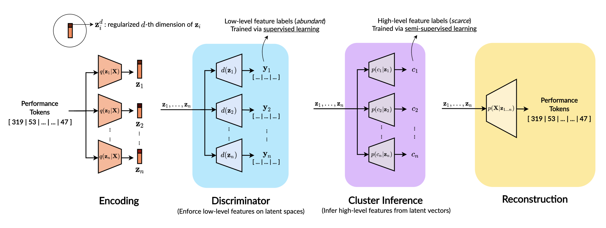

ic FaderNets

This repository contains code for the paper ["Music FaderNets: Controllable Music Generation Based On High-Level Features via Low-Level Feature Modelling"]() by Hao Hao Tan and Dorien Herremans.  

Representations of high-level musical qualities are not easy to learn with supervised learning techniques, either because of the insufficiency of labels, or the subjectiveness (and hence large variance) in human-annotated labels. We propose to use low-level features as "bridges" to between the music and the high level features. Hence, the model consists of:

- **Faders**, which control multiple low-level attributes of the music sample independently in a continuous manner. This relies on latent regularization and feature disentanglement.
- **Presets**, which learn the relationship between the levels of the sliding knobs of low-level features, and the selected high-level feature. This relies on Gaussian Mixture VAEs which imposes hierachical dependencies (c → z → X).



## List of Models

|             Model            |   Trainer Filename   |   Model Classname  |    Evaluation Filename    |
|:----------------------------:|:--------------------:|:------------------:|:-------------------------:|
| Music FaderNets, Vanilla VAE |      `trainer.py`      |   MusicAttrRegVAE  |     `test_vanilla_v2.py`    |
|    Music FaderNets, GM-VAE   |    `trainer_gmm.py`   |  MusicAttrRegGMVAE |       `test_gmm_v2.py`      |
|          Pati et al.         | `trainer_singlevae.py` | MusicAttrSingleVAE |    `test_singlevae_v2.py`   |
|             CVAE             |    `trainer_cvae.py`   |    MusicAttrCVAE   | `test_cvae_v2.py --is_cvae` |
|        Fader Networks        |   `trainer_fader.py`   | MusicAttrFaderNets |      `test_cvae_v2.py`      |
|             GLSR             |    `trainer_glsr.py`   |   MusicAttrRegVAE  |      `test_glsr_v2.py`      |

## Train

1. Download the [Piano e-Competition](https://github.com/jason9693/MusicTransformer-tensorflow2.0/blob/master/dataset/scripts/ecomp_piano_downloader.sh) dataset and [VGMIDI](https://github.com/lucasnfe/vgmidi) dataset. `ptb_v2.py` should parse the dataset into desired event tokens while executing the trainer file.
2. Modify the training configurations in `model_config_v2.json`.
3. Run `python <the-trainer-filename>`.
4. The trained model weights can be found in `params/`folder.

Note that to parse MIDI files into event tokens, [this fork of Magenta repo](https://github.com/gudgud96/magenta) is used with several modifications on the [token parser](https://github.com/gudgud96/magenta/tree/master/magenta).

## Evaluate Controllability

To evaluate the controllability of the model (Table 1 in paper), run `python <the-evaluation-filename>`. Some pre-trained models are attached in the `params` folder as examples.

## Arousal Style Transfer
A simple example for applying "shifting vectors" for arousal transfer with the GM-VAE model is demonstrated in `arousal_transfer.ipynb`.


## Resources
- [arXiv paper]()
- [Demo website](https://music-fadernets.github.io/)

## Citation

This research work is published at ISMIR 2020 as a conference paper.

```
@inproceedings{tan20music,
  author = {Tan, Hao Hao and Herremans, Dorien},
  booktitle={Proc. of the International
Society for Music Information Retrieval Conference},
  title = {Music FaderNets: Controllable Music Generation Based On High-Level Features via Low-Level Feature Modelling},
  year={2020}
}
```
